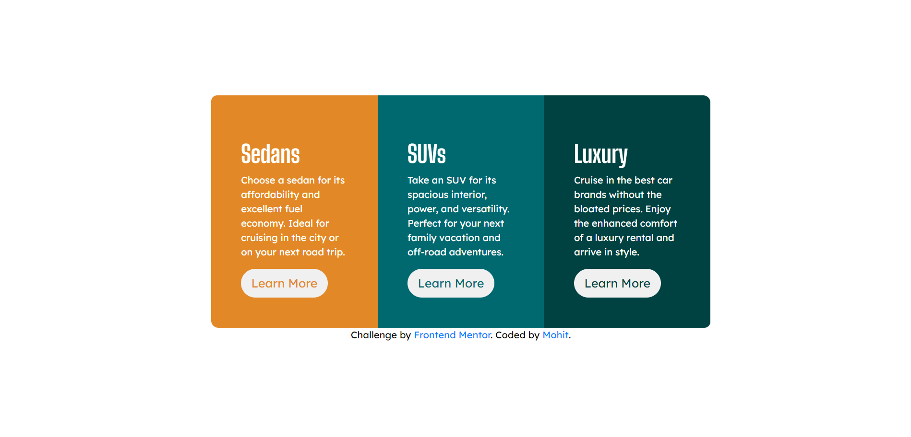

# Frontend Mentor - 3-column preview card component solution

This is a solution to the [3-column preview card component challenge on Frontend Mentor](https://www.frontendmentor.io/challenges/3column-preview-card-component-pH92eAR2-).

## Table of contents

- [Overview](#overview)
  - [The challenge](#the-challenge)
  - [Screenshot](#screenshot)
  - [Links](#links)
- [My process](#my-process)
  - [Built with](#built-with)
  - [What I learned](#what-i-learned)

- [Author](#author)

## Overview

### The challenge

Users should be able to:

- View the optimal layout depending on their device's screen size
- See hover states for interactive elements

### Screenshot

### Links

- Live Site URL: [live site](https://mohit834.github.io/3-column-preview-card/)

## My process
  I started with basic layout and importing bootstrap and I am trying to get good at using bootstrap and after using the bootstrap components I went for the styling of the rest of the site.
  
### Built with

- Semantic HTML5 markup
- CSS custom properties
- Bootstrap
- Mobile-first workflow

### What I learned

Understanding bootstrap components a little more and how to use them in a better way.

## Author

- Frontend Mentor - [@mohit834](https://www.frontendmentor.io/profile/mohit834)

